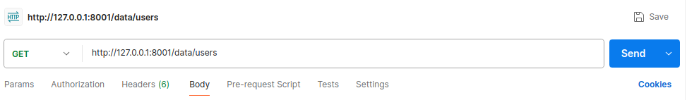
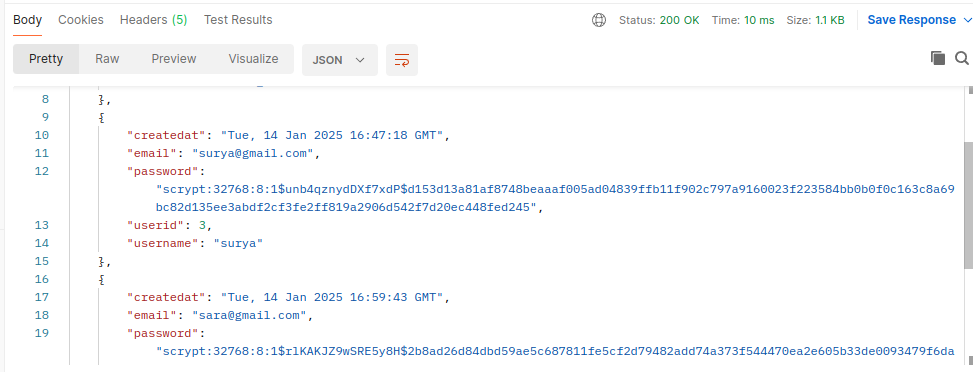
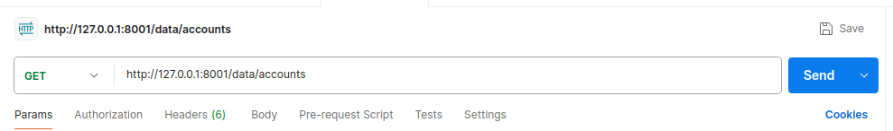
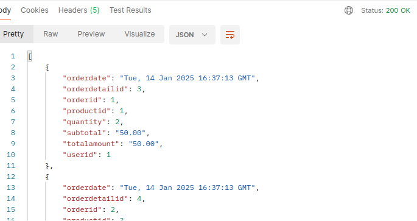

## v0 : Build a Simple Web Application

**Installation :**

```sh 
pip install -r requirements.txt
```

```sh 
python3 main.py
```

Application is running on localhost and port number 8001 


**Objective :**  

Develop a basic RESTful web application with the following functionalities:

**Database Modeling :**

- Create a database named cakedb and connect to the database `\c cakedb`
- The scheme of the tables used in our application stored in cakedb is given below :


| **Table Name**     | **Column Name**    | **Data Type**        | **Constraints**                             |
|---------------------|--------------------|-----------------------|---------------------------------------------|
| **Users**           | UserID            | INT (SERIAL)         | Primary Key                                 |
|                     | Username          | VARCHAR(100)         | NOT NULL                                    |
|                     | Email             | VARCHAR(255)         | UNIQUE, NOT NULL                            |
|                     | Password          | VARCHAR(255)         | NOT NULL                                    |
|                     | CreatedAt         | TIMESTAMP            | Default: CURRENT_TIMESTAMP                  |
|                     |                   |                      |                                             |
| **Products**        | ProductID         | INT (SERIAL)         | Primary Key                                 |
|                     | ProductName       | VARCHAR(255)         | NOT NULL                                    |
|                     | Description       | TEXT                 |                                             |
|                     | ImageURL          | VARCHAR(255)         |                                             |
|                     | Price             | DECIMAL(10, 2)       | NOT NULL                                    |
|                     | Stock             | INT                  | Default: 0                                  |
|                     | CreatedAt         | TIMESTAMP            | Default: CURRENT_TIMESTAMP                  |
|                     |                   |                      |                                             |
| **Orders**          | OrderID           | INT (SERIAL)         | Primary Key                                 |
|                     | UserID            | INT                  | NOT NULL, Foreign Key -> Users(UserID)      |
|                     | OrderDate         | TIMESTAMP            | Default: CURRENT_TIMESTAMP                  |
|                     | TotalAmount       | DECIMAL(10, 2)       | NOT NULL                                    |
|                     |                   |                      |                                             |
| **OrderDetails**    | OrderDetailID     | INT (SERIAL)         | Primary Key                                 |
|                     | OrderID           | INT                  | NOT NULL, Foreign Key -> Orders(OrderID)    |
|                     | ProductID         | INT                  | NOT NULL, Foreign Key -> Products(ProductID)|
|                     | Quantity          | INT                  | NOT NULL                                    |
|                     | SubTotal          | DECIMAL(10, 2)       | NOT NULL                                    |
|                     |                   |                      |                                             |
 
 ---
RESTful API-based web application using Flask :

- List of endpoints provided in the application : 
    - **POST** `/signup` : Register a admin use.
    - **POST** `/login`: Authenticate and generate a JWT for a user.
    - **POST** `/users`: Create a user/customer.
    - **PUT** `/users/u/<user_id>`: Update an existing user's details.
    - **DELETE** `/users/u/<user_id>`: Delete a user and their related orders.
    - **POST** `/products`: Add a new product to the inventory.
    - **PUT** `/products/<product_id>`: Update details of an existing product.
    - **POST** `/orders`: Create a new order for a user.
    - **GET** `/data/<table_name>`: Fetch all records from a specified table.
    - **GET** `/data/accounts`: Joins the tables OrderDetails and Orders to result the transaction record of each user.


- I've implemented input validation of entries such as username, password, etc ,.
- Authentication using JWT tokens are implemented using `flask_jwt_extended`.
- The SECRET Key for JWT access token generation and CONNECTION String for Postgresql DB needs to be specified in `.env `file under the application directory.
  
<br>
**Usage Example : ** 

- On sending a **GET** request to `/data/users` endpoint I receive a JSON response from the user.




- On sending a **GET** request to `/data/accounts` endpoint I receive a JSON response from the user giving all the consolidated order details.





