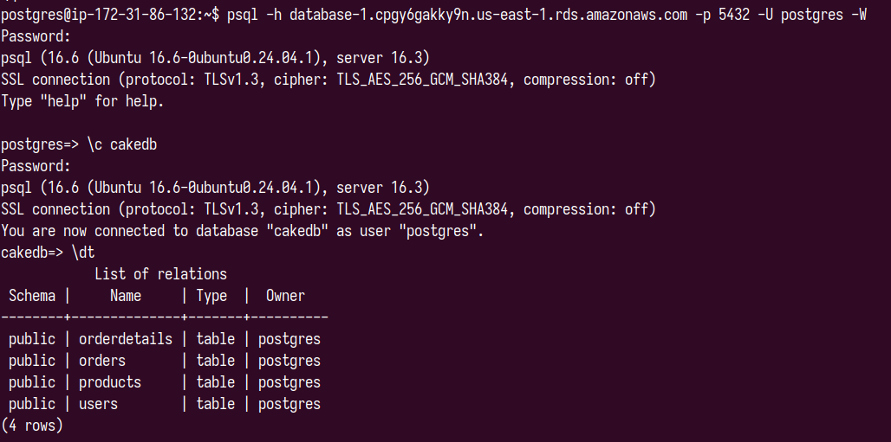

# v1 : Deploy to AWS

**Objective:**  
Deploy the application to **AWS** using appropriate cloud services. Ensure the application is fully functional and accessible.

**Installation :**

```sh 
git clone repo_url

cd app_dir

sudo apt install python3 python3-venv

python3 venv env

source env/bin/activate

pip install -r requirements.txt

# Application will running on localhost:8001
python3 main.py

# Setup reverse proxy
sudo apt install nginx

cat > EC2_public_IPv4_address <<EOF
server {
    listen 80;
    listen [::]:80;
    server_name <EC2_public_IPv4_address>;
        
    location / {
        proxy_pass http://127.0.0.1:8001;
        include proxy_params;
    }
}
EOF

sudo systemctl restart nginx
sudo systemctl status nginx

```

- Deploying the application on EC2 insstance
    - Create an EC2 instance with inbound rules specified in the security group sections to allow all traffic to the instance machine.
    - Deploy our application to the EC2 instance by git cloning our project repository.
    - Once installation on a EC2 instance is completed, the application can be accessed by its `EC2_public_IPv4:port(8001)/endpoint`

- List of endpoints provided in the application : 
    - **POST** `/signup` : Register a admin use.
    - **POST** `/login`: Authenticate and generate a JWT for a user.
    - **POST** `/users`: Create a user/customer.
    - **PUT** `/users/u/<user_id>`: Update an existing user's details.
    - **DELETE** `/users/u/<user_id>`: Delete a user and their related orders.
    - **POST** `/products`: Add a new product to the inventory.
    - **PUT** `/products/<product_id>`: Update details of an existing product.
    - **POST** `/orders`: Create a new order for a user.
    - **GET** `/data/<table_name>`: Fetch all records from a specified table.


- Database 
    - Create a RDS PostgreSQL DB in AWS Dashboard and connect the RDS to our EC2 instance
    - Connect the RDS through SSH and connect to the RDS database using
    `psql -h <rds_endpoint> -p 5432 -U postgres -W`
    - Import the connection string for Postgres RDS DB to .env file in the application folder
    


 