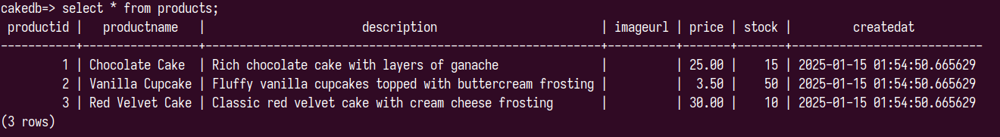

# v3 : Add Product Images and Use S3

**Objective:**  
Enhance the application by adding the ability to upload and store product images in **AWS S3**, and retrieve those images when product details are requested.

Installation:

Follow the install guide specified in app_v1.0 README.md

- The products endpoint now supports the request body to have an image to be upaloaded along with the product parameters.
- The image is uploaded to an AWS S3 bucket and the URL is uploaded to the products schema in RDS database.

- We use the methods provided in `boto3` package to access our bucket. Specify the access tokens and URI in the .env file in the application directory.

