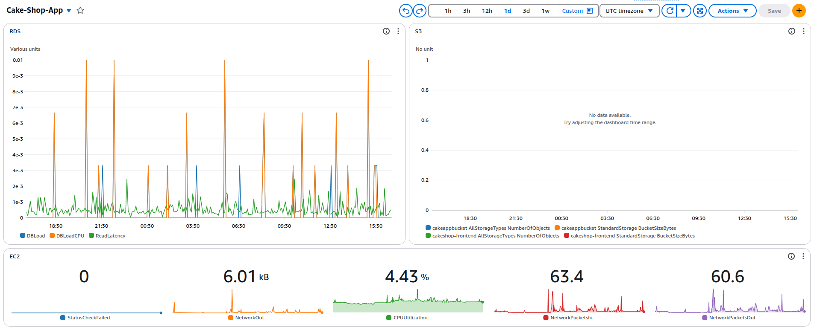

## v3.0 : Build and Host a Simple UI

**Objective:**  
Create a simple front-end web interface to interact with your backend, allowing users to create, update, and view users, products, and orders.

- The frontend is built using HTML, CSS and Vanilla JS.
- The frontend communicates to the backend flask applications via API calls which allows us to perform CRUD operations on the schemas.
- The `index.html` is hosted on S3 bucket and it serves as a static site. The site can be accessed using the url 

```
http://cakeshop-frontend.s3-website-us-east-1.amazonaws.com/
```
- Click [here](http://cakeshop-frontend.s3-website-us-east-1.amazonaws.com/) to redirect to the aboveurl.

- You can either signup as a new user or login in through the application as a SuperUser, which gives you access to the frontend.

- Login in using the credentials :   
    - email id : `admin@gmail.com`  
    - password : `Admin1234`

**Extras** : 
- Basic error handling and authorization of API calls is implemented.
- Access tokens are created at the time of logging in and cached in localstorage.
- AWS CloudWatch is integrated to monitor the resources and logs the usage.


